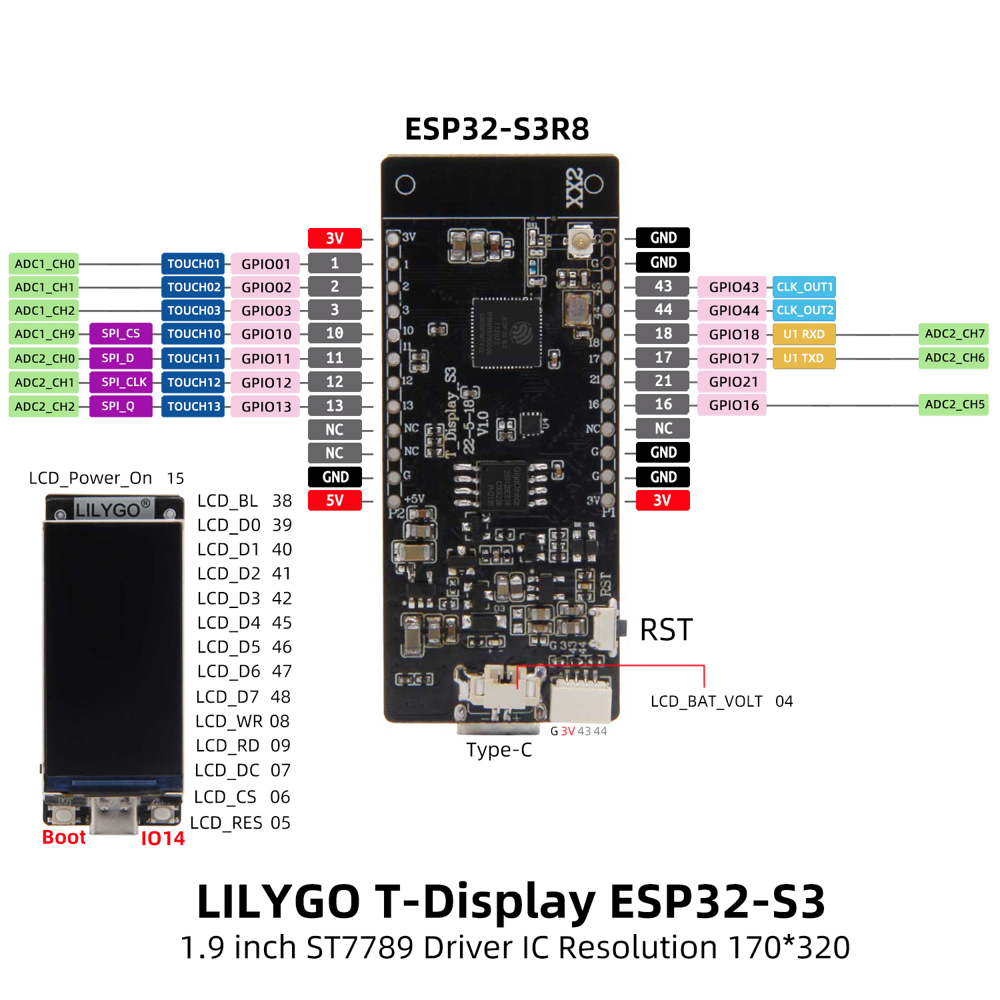

# LILYGO T-Display S3

::::{grid} 12
:::{grid-item}
:columns: 9

:::
:::{grid-item}
:child-align: center
:columns: 3

:::
::::


## Enable Display

```c++
void setup() {
 pinMode(15, OUTPUT);
 digitalWrite(15, HIGH);
}
```

## Brightness

```cpp
const int ledPin = 38;  
const int freq = 5000;  
const int ledChannel = 0;  
const int resolution = 8;  

void setup() {
 ledcSetup(ledChannel, freq, resolution);  
 ledcAttachPin(ledPin, ledChannel);  
 ledcWrite(ledChannel, 25);  // 0-255
}
```

## References

- <https://github.com/Xinyuan-LilyGO/T-Display-S3/>
