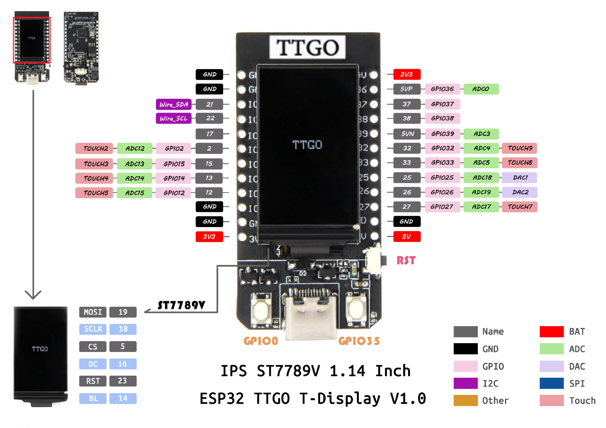

# TTGO T-Display

::::{grid} 12
:::{grid-item}
:columns: 9

:::
:::{grid-item}
:child-align: center
:columns: 3

:::
::::


## Set Battery On

```c
pinMode(15, OUTPUT);
digitalWrite(15, HIGH);
```

## References
- [Github](https://github.com/Xinyuan-LilyGO/TTGO-T-Display)
