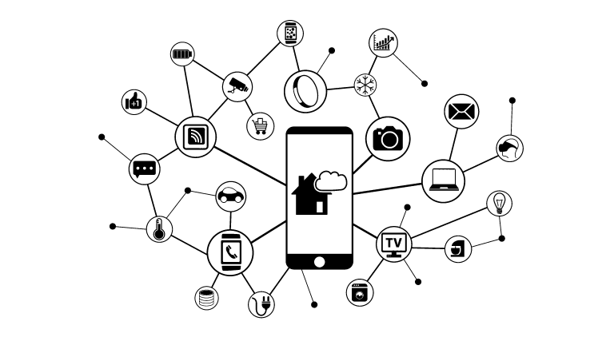

.. learn-iot documentation master file, created by
   sphinx-quickstart on Thu Nov  2 13:25:03 2023.
   You can adapt this file completely to your liking, but it should at least
   contain the root `toctree` directive.

Welcome to IOT's documentation!
=====================================

.. toctree::
   :hidden:
   :maxdepth: 4
   :caption: Boards

   boards/arduino/index
   boards/esp32/index
   boards/RP2040/index

.. toctree::
   :hidden:
   :maxdepth: 4
   :caption: Modules

   modules/displays/index
   modules/sensors/index
   modules/others/index

.. toctree::
   :hidden:
   :caption: Projects

   projects/air_quality

.. toctree::
   :hidden:
   :caption: Smart Home

   smarthome/index

.. toctree::
   :hidden:
   :caption: Resources

   tools

Indices and tables
==================

* :ref:`genindex`
* :ref:`modindex`
* :ref:`search`
