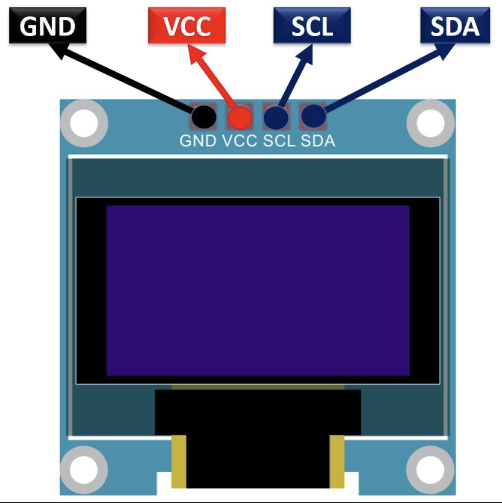
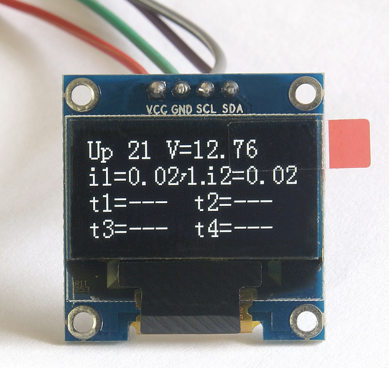

# SSD1306

::::{grid} 2
:::{grid-item}
:child-align: center
:child-direction: row
{height=300}
:::
:::{grid-item}
:child-align: center
:child-direction: row
{height=300}
:::
::::

| Description | Value                    |
|:------------|:-------------------------|
| I2C Address | `0x3C` (Chinese version) |
| Resolution  | `128x64`                 |
| Size        | `0.96"`                  |
